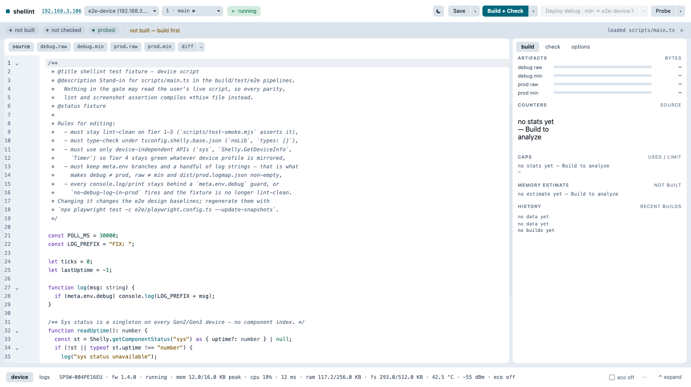

#  shellint

[](https://lukasmega.github.io/deno-kv-analytics/badge)

A local development playground for [Shelly Gen2 device scripts](https://shelly-api-docs.shelly.cloud/gen2/Scripts/Overview):
write them in TypeScript, see what they will cost in RAM and bytes before they
reach the device, and have them checked against the Espruino dialect the device
actually runs — and, when a device is answering, against *that* device's RPC
methods, components and firmware.

Shelly scripts run on Espruino on an ESP32. It is not Node and not a browser:
memory is the binding constraint, the dialect is a subset, and most of what a
general JavaScript toolchain tells you is either irrelevant or wrong. shellint
is built around that.



**[Try it in your browser →](https://mega-brains.github.io/shellint/)** — the same
UI, no server and no device, running the real compiler and the real check engine
in a web worker. The 14 checks that need a device report `skipped`, never a
false `pass`.

## Quick start

```bash
mise install && mise run install
mise run start
```

Then open `http://127.0.0.1:8787` and edit `scripts/main.ts` — created for you
from `templates/main.example.ts` on first run. Without mise:
`npm install && npm run dev`.

No device required. With none configured, shellint starts read-only: editor,
compiler, sizes and the offline check tiers all work; the device panels are
inert.

Or grab a release binary — one file, no Node, under 5 MB:

```bash
curl -fsSL -O https://github.com/mega-brains/shellint/releases/latest/download/shellint-macos-arm64.zip
unzip shellint-macos-arm64.zip && ./shellint
```

## ⚠️ Security — read this before exposing it

**shellint has no authentication of its own.** Anyone who can reach the port can
edit, build and deploy scripts, read your device credentials back out of the UI,
toggle eco mode and reboot the device.

- **The `shellint.json` committed in this repo binds `0.0.0.0`** — the whole LAN,
  on first start, without you choosing it. The code default when no config file
  exists is `127.0.0.1`. If you want the safe one, set it explicitly:

  ```json
  { "host": "127.0.0.1", "port": 8787, "compiler": "shellint" }
  ```

- **Device passwords are stored in plaintext** in `.shellint/devices.json`
  (gitignored, `0600`). Digest auth to the device needs the password back, so it
  is not hashed. Treat that file as a credential store.
- **This is a LAN tool.** Do not put it on a routable interface, behind a
  tunnel, or in front of the internet. There is nothing in it that would survive
  a hostile network.

See [`SECURITY.md`](./.github/SECURITY.md) for the threat model and how to report
something.

## What it does

**Authoring.** TypeScript with real types for the device stdlib — `types/` is
the *whole* library, since the device compile runs `noLib` with `types: []`.
CodeMirror 6 editor, hover docs, type errors and check findings on the gutter.

**Build.** `tsc` → ES5, flat emit, then `meta.env` dead-code elimination →
Terser → optionally `espruino --minify`, producing
`dist/{debug,prod}.{raw.js,js,adv.js}`. Production builds shorten log strings and
ship a map the logs panel re-expands. Any artifact previews read-only in the
editor, including a unified `debug ↔ prod` diff.

**Checks.** 66 named checks in five tiers plus a post-compile dialect guard.
Every run reports pass / warn / fail / **skipped** per rule with a one-line
rationale; a script that does not parse or type-check says so instead of quietly
passing over a recovered AST. Tiers 1–3 are offline; tier 4 needs a device
profile; the capability probe adds `probe-absent-api` from 116 `Script.Eval`
expressions run against real hardware. Two tier-3 findings carry autofixes,
previewed as a diff.

**Dashboard.** Artifact sizes against the device caps, script counters with
click-to-highlight back into the source, a static **RAM estimate** from a JsVar
cost model drawn against the device's measured `mem_peak`, the **minimum
firmware** the script's API use requires, and size + estimate over recent builds.

**Device.** Deploy over WS `PutCode` — debug or prod, minified or raw. Live
telemetry (script mem/cpu, RAM/FS, latency, RSSI), an eco toggle, and a streamed
`ws://<ip>/debug/log` console. Numeric series chart themselves from
`print("#m <series> <value>")`, in hand-rolled inline SVG — no charting
dependency. Multiple devices and script slots switch from the header pickers
(digest auth supported); switching is server-global and resets the device panel
and log stream, so two devices' data never blend.

## Commands

```bash
mise run start            # server (alias: dev)
mise run build            # device artifacts + web bundle
mise run test             # unit + smoke; accepts a name filter
mise run deploy -- debug min    # or: prod raw
mise run probe            # 116 capability probes → types/generated-probe.json
mise run profile          # cache device capabilities for the tier-4 checks
mise run beforeCommit     # the full gate: lint, lines, typecheck, build, test, e2e ×2
mise run build:static     # the offline site/ build
```

Every one is available as `npm run …` too, with identical behaviour.
`mise tasks` lists the rest.

<details>
<summary><strong>Configuration</strong></summary>

`shellint.json` at the repo root:

| Field | Meaning |
|---|---|
| `host` / `port` | HTTP bind. Code default `127.0.0.1:8787`; **the committed file says `0.0.0.0`** — see the security section |
| `compiler` | Must be `"shellint"` (`shelly-forge` is not wired) |
| `minify` | Terser and tier-3 knobs used by the device build |

Devices are not configured here — add one from the UI's header picker
(`+ Add device…`), which writes `.shellint/devices.json`.

</details>

<details>
<summary><strong>Optional txiki.js runtime and the standalone executable</strong></summary>

Node 24 is the default. [txiki.js](https://github.com/saghul/txiki.js) `v26.6.0`
is supported as an opt-in server and CLI runtime — it runs a bundle, because
txiki resolves no npm packages and parses no TypeScript.

One `tjs` build is needed, vendored into gitignored `vendor/txiki/`: the slim
`min` profile that ships inside the compiled executable. Bundling does not use
it — that runs on the repo's own esbuild.

```bash
mise run vendor:txiki          # pinned tag + sha256; --force refetch, --check offline verify
mise run build:txiki
mise run start:txiki
mise run build:txiki:executable && ./.txiki/shellint
```

`build:txiki`, `build:txiki:executable` and `test:txiki` all depend on the
vendor step, so a fresh clone needs no separate command, and none of them
require mise. Binaries are pinned for darwin-arm64, linux-x64 and win32-x64;
elsewhere point `SHELLINT_TJS_BIN` at your own build (a repo-relative value
resolves against the repo root).

Releases ship that executable as a one-file zip per platform —
`shellint-macos-arm64.zip`, `shellint-linux-x64.zip`,
`shellint-windows-x64.zip`. It embeds the runtime, the server bundle and the
browser assets, so the UI works with no checkout beside it. On first run in an
empty directory it writes the files it has to be able to read back —
`templates/main.example.ts`, the three `types/*.d.ts` that are the entire stdlib
for device code, and `scripts/main.ts` from that template — and never overwrites
an existing one.

shellint is still a workspace tool after that: `shellint.json`, `scripts/`,
`dist/` and `.shellint/` live in the launch directory. Peer CLI tasks are
`deploy:txiki`, `probe:txiki`, `profile:txiki` and `test:txiki`. npm install,
TypeScript and Playwright stay on Node.

</details>

<details>
<summary><strong>Using the checks in your own editor</strong></summary>

shellint's checks are hand-rolled TypeScript-AST passes, not lint rules — none
of the cooperative scheduler, the RAM budget, `Shelly.*` existence or the live
capability probe is expressible as an off-the-shelf ESLint plugin.

The *syntax* half of tier 1 is different: it needs no custom rule code at all.
[`templates/eslint.config.mjs`](./templates/eslint.config.mjs) is that half as a
flat config you can copy into your own Shelly script repo, so your editor and CI
flag the same dialect bans. It is a template — shellint neither installs nor
runs ESLint.

</details>

<details>
<summary><strong>Analytics</strong></summary>

The **hosted demo site only** may carry a cookieless pageview beacon — no
cookies, no cross-site identifiers, nothing that follows you off the page. It is
build-time opt-in: `scripts/build-static.mjs` injects it only when
`COLLECTOR_ORIGIN` is set, which happens in this repo's Pages deploy and nowhere
else.

The tool itself never phones home. A local `mise run start`, a self-built
`site/`, a release binary and every fork build with no beacon at all — the
default is off, and there is nothing to opt out of.

</details>

<details>
<summary><strong>Reference — Shelly documentation</strong></summary>

Shelly's own documentation is the authority on what the device accepts —
in particular the
[Language Reference](https://shelly-api-docs.shelly.cloud/gen2/Scripts/LanguageReference),
the script API pages
([Shelly](https://shelly-api-docs.shelly.cloud/gen2/Scripts/APIs/Shelly),
[Timer](https://shelly-api-docs.shelly.cloud/gen2/Scripts/APIs/Timer),
[HTTPServer](https://shelly-api-docs.shelly.cloud/gen2/Scripts/APIs/HTTPServer),
[RPCHandlers](https://shelly-api-docs.shelly.cloud/gen2/Scripts/APIs/RPCHandlers),
[AES](https://shelly-api-docs.shelly.cloud/gen2/Scripts/APIs/AES),
[Virtual](https://shelly-api-docs.shelly.cloud/gen2/Scripts/APIs/Virtual)),
the [RPC protocol](https://shelly-api-docs.shelly.cloud/gen2/General/RPCProtocol)
and [debug logs](https://shelly-api-docs.shelly.cloud/gen2/General/DebugLogs)
pages, and the [changelog](https://shelly-api-docs.shelly.cloud/gen2/changelog)
— the API moves.

</details>

## Status

Working and in daily use by its author against real hardware. Pre-1.0: the API
surface may move.

The full gate (lint, typecheck, build, unit tests, and the e2e suite on both the
Node server and the txiki executable) runs green on macOS and Linux in CI. Each
release binary is built, size-asserted under 5 MB and boot-tested on its own
platform, but only macOS arm64 has been exercised end to end by a human — treat
the Linux and Windows binaries as working-but-unproven.

## Contributing

See [`CONTRIBUTING.md`](./.github/CONTRIBUTING.md). Short version: `mise run
beforeCommit` must be green, source files stay under 500 lines, and design
changes need baselines refreshed on both macOS and Linux.

## Trademark

Not affiliated with, endorsed by, or sponsored by Allterco Robotics or Shelly.
"Shelly" and "Espruino" are the trademarks of their respective owners and are
used here only to name the target platform.

## License

[MIT](./LICENSE).
